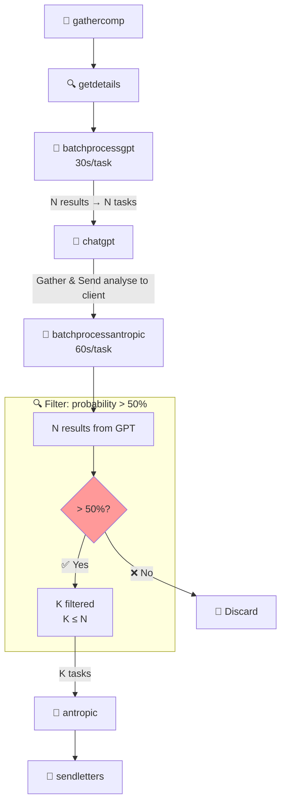

***

<div align="center">
  <strong>B2b Lead Generation Prototype</strong>
</div>

***

# Lead Generation Pipeline 🚀

**Automated B2B lead generation pipeline using 7 GCP Cloud Run microservices, Google Places API, GPT-4o, Claude Sonnet, and serverless architecture**

***

## 🏗️ Architecture (7 Microservices)


## 📁 Microservices Structure

```
LeadGenerator/
├── gathercomp/              # Places API grid search (2km² cells)
├── getdetails/              # Place Details API (40/batch processing)
├── batchprocessgpt/         # Cloud Tasks orchestrator (GPT pipeline)
├── chatgpt/                 # GPT-4o-mini + scraping (scrap.js)
├── batchprocessantropic/    # Cloud Tasks (Sonnet, 50%+ threshold)
├── antropic/                # Claude 3.5 Sonnet proposals
└── sendletters/             # SMTP + IMAP delivery
```

## 🔧 Technology Stack

```
GCP Serverless Infrastructure:
├── Cloud Run (7 independent microservices)
├── Cloud Tasks (distributed orchestration + rate limiting)
├── Cloud Storage (JSON session persistence)
└── Secret Manager (API key management)

External APIs & Integrations:
├── Google Places API v1 (Text Search + Place Details)
├── Google Geocoding API (address → lat/lon)
├── OpenAI GPT-4o-mini API (structured data extraction)
├── Anthropic Claude 3.5 Sonnet API (content generation)
└── Custom geospatial grid algorithm (2km² cells)

Production Email Infrastructure:
├── Nodemailer (SMTP delivery)
├── imap-simple (Sent folder synchronization)
└── iconv-lite (UTF-8 encoding handling)

Web Scraping Pipeline:
├── Cheerio (server-side DOM parsing)
└── html-to-text (content extraction)
```

## 📊 Pipeline Stages

| # | Service | Input | Output | Key Features |
|---|---------|-------|--------|--------------|
| 1 | `gathercomp` | Location + radius | Place IDs | 2km² grid search + Places API pagination |
| 2 | `getdetails` | Place IDs | Websites + Reviews | 40 parallel requests + recursive batching |
| 3 | `batchprocessgpt` | Session JSON | GPT Tasks | Cloud Tasks (30s rate limiting) |
| 4 | `chatgpt` | Websites + Reviews | Contacts + Scores | GPT-4o JSON mode + website scraping |
| 5 | `batchprocessantropic` | Probability >50% | High-value leads | Cloud Tasks (60s) + email validation |
| 6 | `antropic` | High-value leads | Proposals | Claude 3.5 Sonnet generation |
| 7 | `sendletters` | Proposals + Emails | Delivered emails | SMTP delivery + IMAP sync |


## 🔄 How It Works (Business Flow)

| Stage | **Purpose** | **Technology** |
|-------|-------------|----------------|
| **0. Sales Input** | **Salesperson provides** target companies via **Dialogflow Conversational Bot** | **Dialogflow CX** (Manages input information) |
| **1. Company Discovery**<br>`gathercomp` → `getdetails` | **Find all niche players** by geo from sales input | **Places API** (Text Search 2km² grid + Details 40/batch) |
| **2. Contact Extraction**<br>`chatgpt` | **Extract emails/phones** + **purchase intent analysis** | **GPT-4o-mini** (JSON mode: "Will buy service? 0-100 score") + **Cheerio scraping** |
| **3. Lead Filtering**<br>`batchprocessantropic` | **Filter weak leads** (>50% purchase probability only) | **Cloud Tasks** (60s intervals) + GPT scoring |
| **4. Personalized Emails**<br>`antropic` | **Generate custom proposals** for high-intent leads | **Claude 3.5 Sonnet** (personalized content) |
| **5. Delivery + Tracking**<br>`sendletters` | **Deliver + confirm sent** status | **SMTP** (nodemailer) + **IMAP** (Sent folder sync) |


## 🎯 Key Technical Solutions

```
✅ Pipeline Architecture: Independent per-company processing

  Individual company failures don't block pipeline (99/100 success)

  Cloud Tasks automatic retries (5 attempts per failed task)

  Incremental session updates (GCS JSON merge preserves partial success)

✅ Custom geospatial grid algorithm (2km² cells for Places API coverage)
✅ API quota optimization (40 Place Details/batch + recursive chaining)
✅ Multi-external-API orchestration (Places → GPT → Claude → Email)
✅ Distributed rate limiting via Cloud Tasks (30s/60s intervals)
✅ GCS session persistence ({...old_data, ...new_data} merge pattern)
✅ Recursive website crawling (contact pages + mailto targeting)
✅ Production email system (SMTP delivery + IMAP Sent folder sync)
✅ UTF-8 encoding pipeline (iconv-lite for international content)
```

***

**Production B2B Lead Generation System**  
**7 Independent Cloud Run Microservices | Serverless | Production Architecture**

***

## 👨‍💻 Author

**Danial Akhmetbek**  
[LinkedIn](https://www.linkedin.com/in/danial-undefined-73b230385/) | [danial.ahmetbek@gmail.com](mailto:danial.ahmetbek@gmail.com)

[![Status][status-badge]][status-url]

[status-badge]: https://img.shields.io/badge/status-prototype-green.svg
[status-url]: https://github.com/danialahmetbek/LeadGenerator
